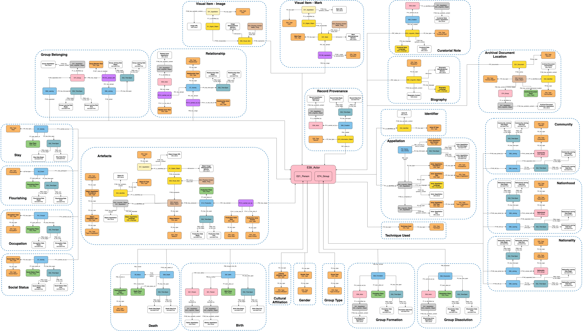

---
# Feel free to add content and custom Front Matter to this file.
# To modify the layout, see https://jekyllrb.com/docs/themes/#overriding-theme-defaults

layout: home
language: fr
title: Aperçu de DOPHEDA
permalink: /fr
other_link: /en
date: 2021-04-29
---

Diagramme de A à Z
> La version interactive peut être consultée [ici](/collections-model/en/target-model/current/introduction#a-z-diagram). Avertissement: Il s'agit d'un diagramme en anglais seulement. 

DOPHEDA est actuellement développé par le RCIP pour représenter les données et la documentation sur le patrimoine des établissements canadiens. Bien que le RCIP soit le gardien des données qui seront versées dans les DOPHEDA, ces données seront fournies exclusivement par des collaborateurs externes (p. ex. musées, bibliothèques, chercheurs). DOPHEDA comprendra au moins deux facettes principales (Acteurs et Objets) ainsi que plusieurs affichages (Créateurs au Canada, Artefacts Canada). Ceux-ci seront interreliés et offriront l’environnement nécessaire pour mieux présenter le patrimoine et le contenu canadiens en ligne au moyen de sites Web, de plateformes et d’applications sur mesure.

DOPHEDA est un projet complexe qui prévoit la refonte de l’offre en ligne du RCIP selon les principes des DOL, ainsi que la révision de sa portée, de son but et de ses fonctionnalités. Il faudra également créer une facette entièrement nouvelle dédiée aux personnes (la facette Acteurs), ainsi qu’une perspective axée sur les créateurs canadiens (intitulée « Créateurs au Canada »). Cette dernière facette sera éventuellement liée à des enregistrements sur des objets (dans la facette Objets, avec un affichage consacré aux objets contenus dans la base de données actuelle d’Artefacts Canada).

Les facettes Acteurs et Objets seront égales et interreliées. La distinction entre ces deux facettes permet un développement progressif de DOPHEDA (la facette Acteurs étant de plus petite envergure) . DOPHEDA impliquera de nombreux champs complexes liés aux objets (techniques, matériaux, supports, etc.), ainsi qu’aux acteurs (personnes et groupes). Il s’agit donc d’un projet ambitieux, tant sur le plan du développement que de l’exécution.

La documentation présentée ici est une collection de documents de travail. À ce titre, bien qu’elle soit publiquement disponible, elle ne constitue en rien une publication officielle et des changements y sont apportés sur une base régulière. En raison de ces modifications régulières, la majorité du contenu présenté ici n'est disponible qu'en anglais et ne sera traduit que lors de la publication d'une version stable et officielle de cette documentation.

<h1 class="post-title">Avancement du projet</h1>

## À ce jour

- Modélisation et description des [patrons conceptuels](/collections-model/en/target-model/current/introduction) (disponible en anglais seulement) et des  [noeuds](/collections-model/en/semantic-paths-specification/current/introduction) (disponible en anglais seulement) nécessaires à l’identification et la description de personnes et de groupes pertinents au milieu patrimonial, aux principaux évènements qui ponctuent normalement leurs vies, et aux relations qu’ils entretiennent;
- Recherche et rapports initiaux sur l’utilisation de [graphes nommés](/collections-model/en/technical-reports/current/named-graph-survey-report-1) (disponible en anglais seulement) dans un contexte d'agrégation patrimoniale, ainsi que sur la [structure des URIs](/collections-model/en/technical-reports/current/uris-technical-report) (disponible en anglais seulement) dans l’environnement DOPHEDA;
- Ressources sur l’[utilisation de la documentation de l’ontologie CIDOC CRM](/collections-model/fr/ressources/actuel/tutoriel-cidoc-crm), les [avantages et les défis](https://chin-rcip.github.io/collections-model/fr/ressources/actuel/dol-avantages-defis) des données ouvertes et liées en milieu patrimonial, les [principaux termes nécessaires à la compréhension](https://chin-rcip.github.io/collections-model/fr/ressources/actuel/glossaire), et l’utilisation d’[outils](https://chin-rcip.github.io/collections-model/fr/ressources/actuel/outils) disponibles. 

## En cours

- Documentation exhaustive des patrons conceptuels modélisés et des noeuds de la facette Acteurs, laquelle comprend davantage d’information quant à leurs cadre et leur contexte; 
- Documentation sur les principes de gouvernance et les décisions portant sur les URIs dans l’environnement DOPHEDA.

## À venir

- Recherche, conceptualisation, et modélisation de patrons conceptuels portant sur l’identité des personnes et des groupes, sur les principales catégories pertinentes dans ce contexte, et sur l’éthique qui entoure le développement et l’utilisation de tels patrons; 
- Identification des besoins minimaux en ce qui a trait au développement de patrons conceptuels portant sur l’identification et la description d'artefacts (matériels et immatériels) et de cultures, sur les principaux évènements qui sont généralement recensés à leur égard, et sur leurs relations avec les personnes et les groupes; 
- Ressources sur les principes, la méthodologie et les approches qui guident le projet; 
- Ressources didactiques sur l’utilisation de la documentation DOPHEDA; 
- Recommandations de mise en correspondance avec le modèle DOPHEDA.
